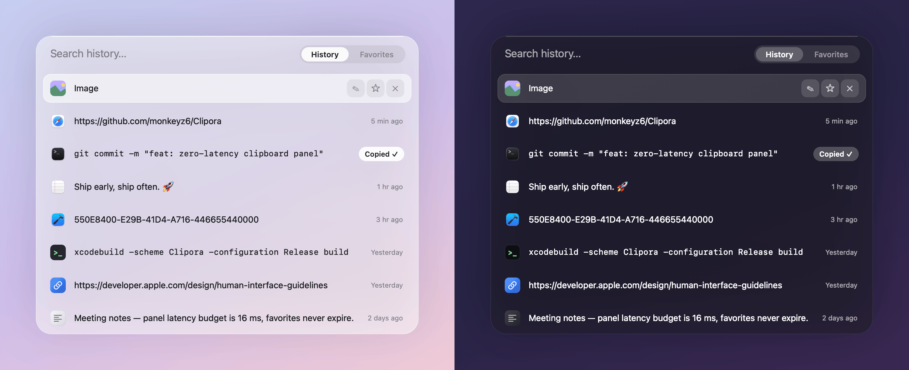
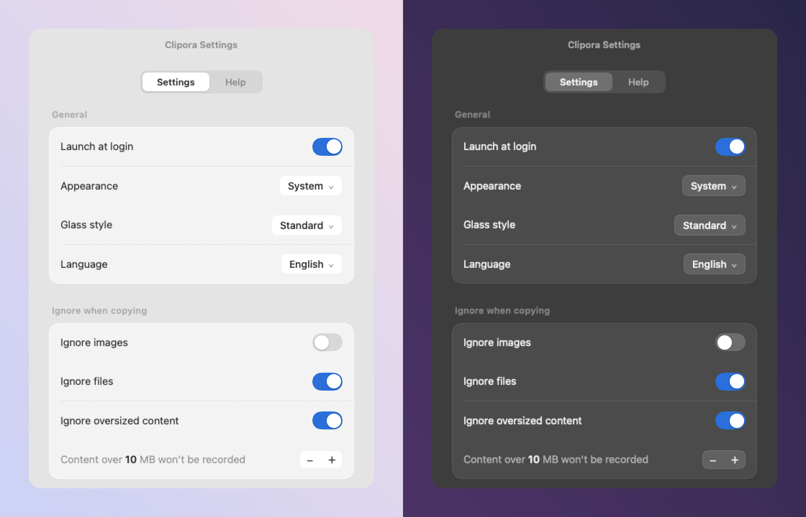

<div align="center">


# Clipora

**A tiny, beautiful clipboard history manager for the macOS menu bar.**

Instant access · Native experience · Minimal resource footprint · Elegant glassmorphism

[](#requirements)
[](Clipora.xcodeproj)
[](LICENSE)
[](https://github.com/monkeyz6/Clipora/releases)

English | [简体中文](README.zh-CN.md)



</div>

## Features

Pure custom-drawn AppKit rendering, disappears instantly after selection. No Dock icon, no Electron, no analytics, and no network requests. Just a pure clipboard history manager that feels like it's built right into the system.

- **Instant Response**: Summoned via a global hotkey, offering a zero-latency, buttery-smooth experience.
- **Incredibly Lightweight**: Approximately 7 MB in size and 17 MB in memory footprint, built entirely with native AppKit.
- **Comprehensive History**: Intelligently categorizes text, URLs, images, and files, complete with distinctive badges for easy recognition.
- **Favorites & Aliases**: Permanently save essential snippets, with support for custom naming and grouped organization.
- **Real-Time Search**: Type to filter instantly, navigate entirely via keyboard, and press Enter to copy.
- **Native Aesthetics**: Choose from 7 distinct glass styles that integrate seamlessly with macOS Light and Dark modes.
- **Smart Cleanup**: Manage history limits automatically and optionally skip large files to save storage space.

## Keyboard Shortcuts

| Shortcut | Action |
|---|---|
| `⌘ J` | Toggle panel (History tab) |
| `⌘ ⇧ J` | Toggle panel (Favorites tab) |
| `Tab` | Switch between History and Favorites |
| `↑` / `↓` | Navigate selection |
| `Enter` / Click | Copy item and hide panel |
| `Esc` | Hide panel |
| `⌘ D` | Star / Unstar selected item |
| `⌘ ⌫` | Delete current item (unstars if in Favorites tab) |

*Note: Summon hotkeys can be customized via **App Settings → Shortcuts** (right-click the menu bar icon).*

## Settings

<div align="center">

</div>

- **General**: Launch at login, appearance, glass style, and language (English / 中文).
- **Ignore Rules**: Skip images, files, or content over a specific size threshold.
- **Cleanup**: Auto-delete history older than N days (favorites are never touched).
- **Shortcuts**: Rebind both summon hotkeys.

## Installation

### Pre-compiled binaries

Download the latest `Clipora-x.y.dmg` from [Releases](https://github.com/monkeyz6/Clipora/releases), and drag Clipora into your **Applications** folder.

> [!NOTE]
> If you encounter a macOS security warning on first launch, **right-click the app → Open**, or execute the following command in Terminal:
> ```sh
> xattr -cr /Applications/Clipora.app
> ```

### Build from source

Requires Xcode 16.3 or later, targeting macOS 14.0 or above. The build process will automatically resolve Swift dependencies.

```sh
git clone https://github.com/monkeyz6/Clipora.git
cd Clipora
xcodebuild -project Clipora.xcodeproj -scheme Clipora -configuration Release build
open ~/Library/Developer/Xcode/DerivedData/Clipora-*/Build/Products/Release/Clipora.app
```

## Data & Privacy

**Strict Privacy Protection**. Clipora makes zero network requests. There are no accounts, no cloud syncing, and absolutely no data collection. Your clipboard data remains exclusively on your local machine.

- Database path: `~/Library/Application Support/Clipora/clipora.sqlite`
- Images directory: `~/Library/Application Support/Clipora/images/`

## Requirements

Compatible with macOS 14.0 and later (tested on macOS Sonoma, Sequoia, and beyond).

## License

Released under the [MIT License](LICENSE) © 2026 monkeyz6
