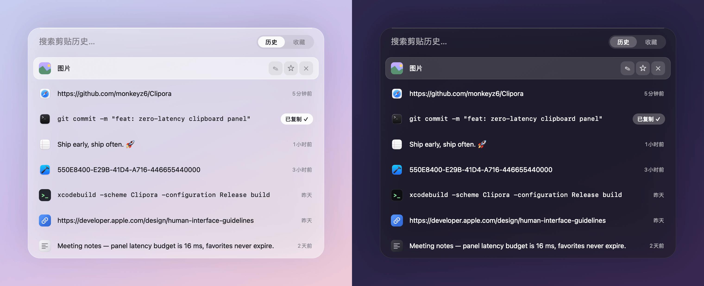
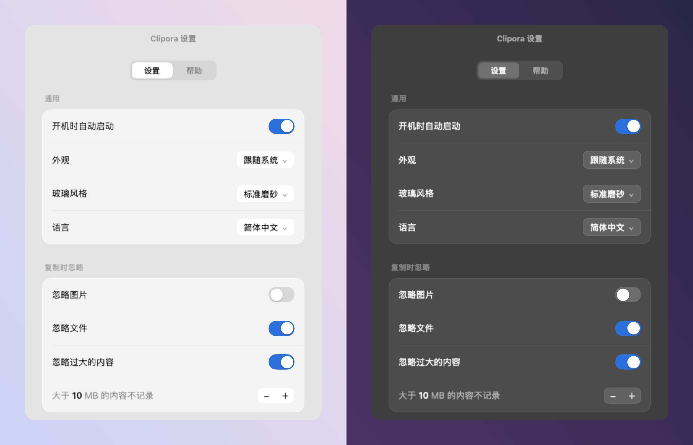

<div align="center">


# Clipora

**小而美的 macOS 菜单栏剪贴板历史管理工具。**

极速呼出 · 原生体验 · 资源极低占用 · 优雅毛玻璃设计

[](#系统要求)
[](Clipora.xcodeproj)
[](LICENSE)
[](https://github.com/monkeyz6/Clipora/releases)

[English](README.md) | 简体中文



</div>

## 功能特性

纯手绘 AppKit 渲染、选完即走，没有 Dock 图标，没有 Electron，没有数据统计，没有网络请求，一个纯粹的历史剪切板，就像是系统自带的一样。

- **极速响应**：支持全局快捷键唤醒，提供零延迟的流畅体验。
- **极致轻量**：应用体积约 7 MB，内存占用约 17 MB，完全基于原生 AppKit 构建。
- **全能记录**：智能识别文本、URL、图片与文件，并配有专属徽章以便于辨识。
- **收藏&别名**：支持永久保存重要片段，并提供自定义命名及分类管理功能。
- **即时搜索**：输入即可过滤，支持全键盘导航，按回车键即可快速复制。
- **原生意境**：提供 7 档玻璃效果自由切换，完美适配 macOS 深色与浅色模式。
- **智能清理**：提供历史记录数量上限管理功能，支持过滤大型文件，有效节约存储空间。

## 快捷键操作

| 快捷键 | 行为 |
|---|---|
| `⌘ J` | 呼出/关闭面板（历史记录） |
| `⌘ ⇧ J` | 呼出/关闭面板（收藏夹） |
| `Tab` | 切换历史与收藏页面 |
| `↑` / `↓` | 导航选中项 |
| `Enter` / 单击 | 复制并隐藏面板 |
| `Esc` | 隐藏面板 |
| `⌘ D` | 收藏/取消收藏 |
| `⌘ ⌫` | 删除当前项（在收藏页面中为取消收藏） |

*注：呼出快捷键可通过右击菜单栏图标，在“应用设置 → 快捷键”中进行自定义。*

## 设置

<div align="center">

</div>

- **通用**：开机自启、外观、玻璃风格、语言（English / 中文）。
- **忽略规则**：跳过图片、文件或超过体积阈值的内容。
- **清理**：自动删除 N 天前的历史（收藏项永不清理）。
- **快捷键**：自定义两个呼出快捷键。

## 快速安装

### 预编译版本

请前往 [Releases](https://github.com/monkeyz6/Clipora/releases) 下载最新版本的 `Clipora-x.y.dmg`，将其拖入 **Applications** 文件夹即可完成安装。

> [!NOTE]
> 首次启动时若遇到 macOS 安全提示，请**右键应用 → 打开**，或在终端执行以下命令：
> ```sh
> xattr -cr /Applications/Clipora.app
> ```

### 源码构建

编译环境要求 Xcode 16.3 及以上版本，支持 macOS 14.0 及以上系统。构建时将自动拉取所需的 Swift 依赖包。

```sh
git clone https://github.com/monkeyz6/Clipora.git
cd Clipora
xcodebuild -project Clipora.xcodeproj -scheme Clipora -configuration Release build
open ~/Library/Developer/Xcode/DerivedData/Clipora-*/Build/Products/Release/Clipora.app
```

## 数据与隐私

**严格保护隐私**。Clipora 不会发起任何网络请求，无账号系统，不支持云端同步且无任何数据收集行为。所有剪贴板数据均独立存储于本地。

- 数据库路径：`~/Library/Application Support/Clipora/clipora.sqlite`
- 图片库路径：`~/Library/Application Support/Clipora/images/`

## 系统要求

兼容 macOS 14.0 及以上版本（已在 Sonoma、Sequoia 等系统版本上完成测试）。

## 开源协议

基于 [MIT](LICENSE) 协议开源 © 2026 monkeyz6
